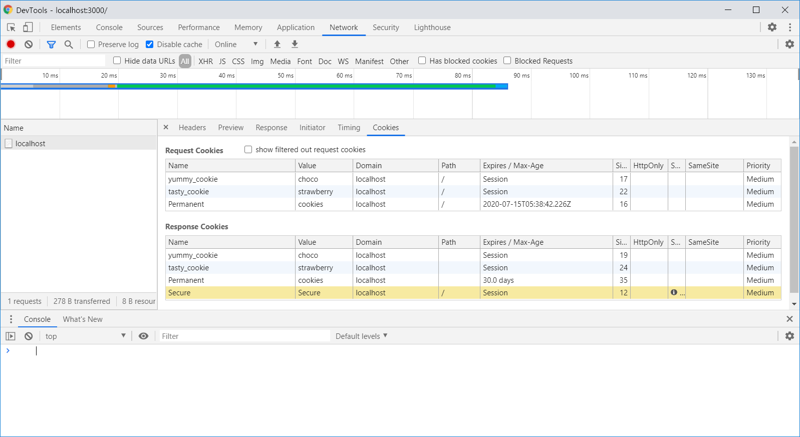

# 생활 코딩

## Nodejs 쿠기와 인증

### 1. 쿠키의 생성

- 쿠키의 세 가지 용도
  - 세션 관리(Session management)
  - 개인화(Personalization)
  - 트래킹(Tracking)

```javascript
// 쿠키 생성
var http = require('http');
http.createServer(function (request, response) {
    response.writeHead(200, {
        'Set-Cookie': ['yummy_cookie=choco', 'tasty_cookie=strawberry']
    });
    response.end('Cookie!!');
}).listen(3000);
```


- Set-Cookie라는 두 개의 헤더값이 추가된 것을 볼 수 있다.
- 주석처리하여 서버가 Set-Cookie 헤더를 보내지 않도록 처리하더라도, 쿠키 값이 심어져 있다.
- 쿠키는 application 탭에서 지울 수 있다.

### 2. 쿠키의 읽기

- request.headers.cookie는 문자열을 반환하며, 쿠키가 복수인 경우 지저분해 보일 수 있다.
- cookie 모듈은 쿠키 값을 객체화시켜 반환한다.

```javascript
// 쿠키 읽기
var http = require('http');
var cookie = require('cookie')
http.createServer(function (request, response) {
    var cookies = {}
    if (request.headers.cookie !== undefined) {
        cookies = cookie.parse(request.headers.cookie);
    }
    console.log(cookies.yummy_cookie)
    response.writeHead(200, {
        'Set-Cookie': ['yummy_cookie=choco', 'tasty_cookie=strawberry']
    });
    response.end('Cookie!!');
}).listen(3000);
```

### 3. 쿠키의 활용

- 어느 웹 사이트의 경우 쿠키를 이용하여 언어 설정을 할 수 있다.
- sessionid 쿠키 값을 이용하면 비밀번호는 알 순 없지만, 로그인은 가능하다.

### 4. Session vs Permanent

- Session cookies: 웹 브라우저가 켜져있는 동안 유효
- Permanent cookies: 웹 브라우저를 껐다 켜도 유효
  - Max-age: 쿠키가 현재 시점을 기준으로 얼마동안 살 것인가
  - Expires: 쿠키가 언제 만료되는 가

```javascript
var http = require('http');
var cookie = require('cookie')
http.createServer(function (request, response) {
    var cookies = {}
    if (request.headers.cookie !== undefined) {
        cookies = cookie.parse(request.headers.cookie);
    }
    console.log(cookies.yummy_cookie)
    response.writeHead(200, {
        'Set-Cookie': [
            'yummy_cookie=choco',
            'tasty_cookie=strawberry',
            `Permanent=cookies; Max-age=${60*60*24*30}` // 한 달
        ]
    });
    response.end('Cookie!!');
}).listen(3000);
```


- Expires / Max-age에 값이 생성된 것을 볼 수 있다.

### 5. Secure & HttpOnly

- Secure: HTTPS 통신의 경우에만 쿠키를 전송

```javascript
var http = require('http');
var cookie = require('cookie')
http.createServer(function (request, response) {
    var cookies = {}
    if (request.headers.cookie !== undefined) {
        cookies = cookie.parse(request.headers.cookie);
    }
    console.log(cookies.yummy_cookie)
    response.writeHead(200, {
        'Set-Cookie': [
            'yummy_cookie=choco',
            'tasty_cookie=strawberry',
            `Permanent=cookies; Max-age=${60*60*24*30}`,
            'Secure=Secure; Secure',
        ]
    });
    response.end('Cookie!!');
}).listen(3000);
```



- HTTP 통신을 하기 때문에, Response 헤더에만 추가된 것을 볼 수 있다.

- HttpOnly: 웹 브라우저와 웹 서버가 통신할 때만 쿠키를 전송

```javascript
var http = require('http');
var cookie = require('cookie')
http.createServer(function (request, response) {
    var cookies = {}
    if (request.headers.cookie !== undefined) {
        cookies = cookie.parse(request.headers.cookie);
    }
    console.log(cookies.yummy_cookie)
    response.writeHead(200, {
        'Set-Cookie': [
            'yummy_cookie=choco',
            'tasty_cookie=strawberry',
            `Permanent=cookies; Max-age=${60*60*24*30}`,
            'Secure=Secure; Secure',
            'HttpOnly=HttpOnly; HttpOnly'
        ]
    });
    response.end('Cookie!!');
}).listen(3000);
```


- 콘솔 창을 보면 HttpOnly 플래그가 체크된 쿠키는 자바스크립트를 통해 접근할 수 없다.

### 6. path & domain

- Path: 특정 디렉토리에서만 쿠키가 활성화되도록 할 때 사용
- Domain: 특정 도메인에서만 쿠키가 활성화되도록 할 때 사용

```javascript
var http = require('http');
var cookie = require('cookie')
http.createServer(function (request, response) {
    var cookies = {}
    if (request.headers.cookie !== undefined) {
        cookies = cookie.parse(request.headers.cookie);
    }
    console.log(cookies.yummy_cookie)
    response.writeHead(200, {
        'Set-Cookie': [
            'yummy_cookie=choco',
            'tasty_cookie=strawberry',
            `Permanent=cookies; Max-age=${60*60*24*30}`,
            'Secure=Secure; Secure',
            'HttpOnly=HttpOnly; HttpOnly',
            'Path=path; Path=/cookie'
        ]
    });
    response.end('Cookie!!');
}).listen(3000);
```


- path라는 쿠키는 root 디렉터리에서는 살아있지 않으며, /cookie 디렉터리에서만 살아있다.

### 7. 인증 구현

- UI 만들기
- 로그인 쿠키 생성
- 로그인 상태 체크
- 로그인 상태를 UI에 반영
- 로그아웃
- 접근제어: 로그인이 된 사람만 create, delete, update가 가능하게끔 하는 것
